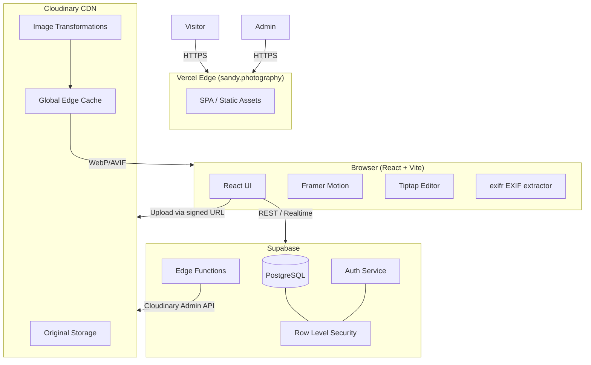
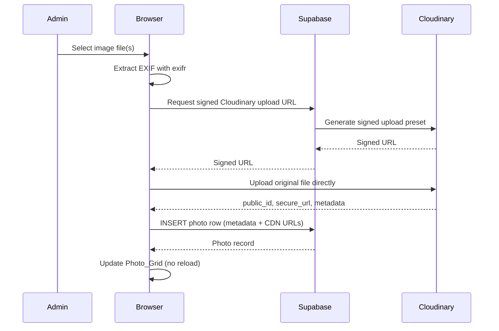
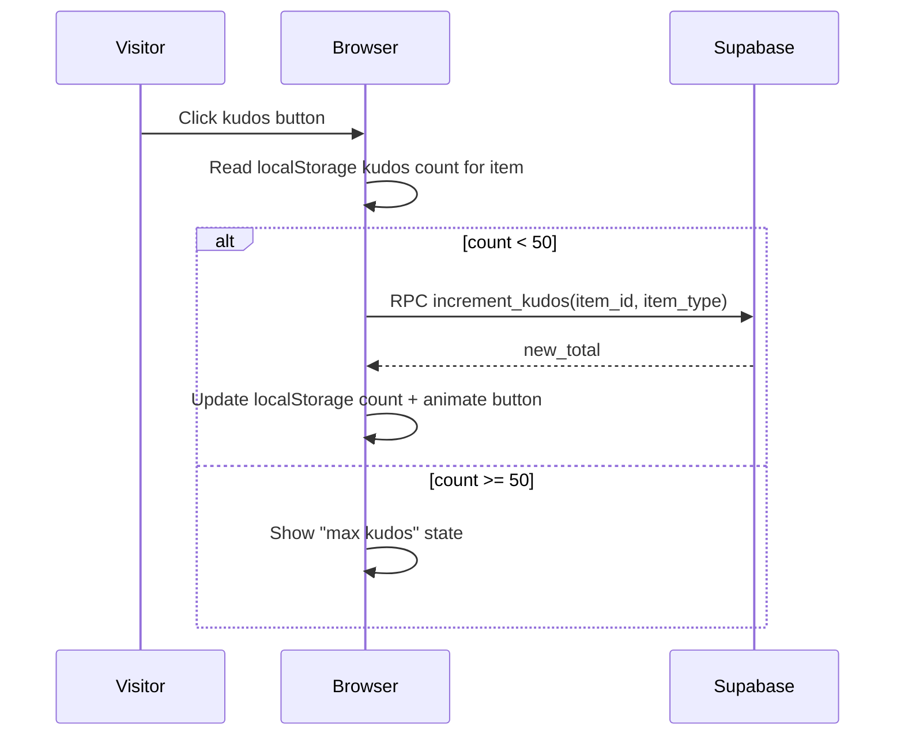

# sandy.photography
---
### System Architecture Diagram

```mermaid
graph TB
    subgraph Client ["Browser (React + Vite)"]
        UI[React UI]
        EM[Framer Motion]
        TE[Tiptap Editor]
        EX[exifr EXIF extractor]
    end

    subgraph Vercel ["Vercel Edge (sandy.photography)"]
        SPA[SPA / Static Assets]
    end

    subgraph Supabase ["Supabase"]
        DB[(PostgreSQL)]
        AUTH[Auth Service]
        RLS[Row Level Security]
        EF[Edge Functions]
    end

    subgraph Cloudinary ["Cloudinary CDN"]
        ORIG[Original Storage]
        TRANS[Image Transformations]
        EDGE[Global Edge Cache]
    end

    Visitor -->|HTTPS| Vercel
    Admin -->|HTTPS| Vercel
    UI -->|REST / Realtime| Supabase
    UI -->|Upload via signed URL| Cloudinary
    EF -->|Cloudinary Admin API| Cloudinary
    DB --- RLS
    AUTH --- RLS
    TRANS --> EDGE
    EDGE -->|WebP/AVIF| Client
```

### Request Flow: Photo Upload

```mermaid
sequenceDiagram
    participant Admin
    participant Browser
    participant Supabase
    participant Cloudinary

    Admin->>Browser: Select image file(s)
    Browser->>Browser: Extract EXIF with exifr
    Browser->>Supabase: Request signed Cloudinary upload URL
    Supabase->>Cloudinary: Generate signed upload preset
    Cloudinary-->>Supabase: Signed URL
    Supabase-->>Browser: Signed URL
    Browser->>Cloudinary: Upload original file directly
    Cloudinary-->>Browser: public_id, secure_url, metadata
    Browser->>Supabase: INSERT photo row (metadata + CDN URLs)
    Supabase-->>Browser: Photo record
    Browser->>Browser: Update Photo_Grid (no reload)
```

### Request Flow: Kudos

```mermaid
sequenceDiagram
    participant Visitor
    participant Browser
    participant Supabase

    Visitor->>Browser: Click kudos button
    Browser->>Browser: Read localStorage kudos count for item
    alt count < 50
        Browser->>Supabase: RPC increment_kudos(item_id, item_type)
        Supabase-->>Browser: new_total
        Browser->>Browser: Update localStorage count + animate button
    else count >= 50
        Browser->>Browser: Show "max kudos" state
    end
```

---
