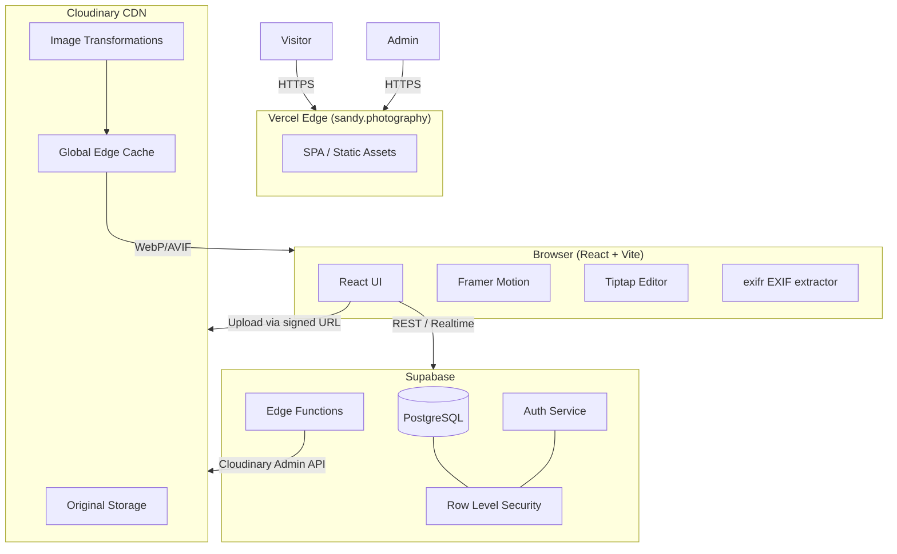
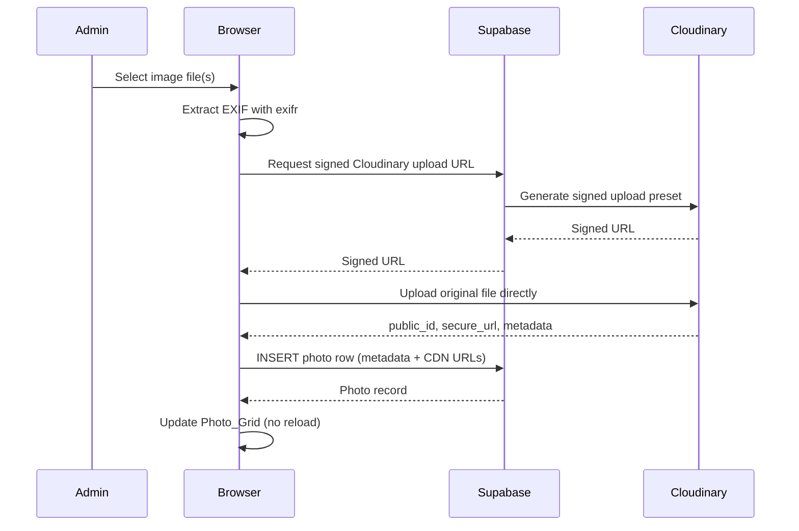
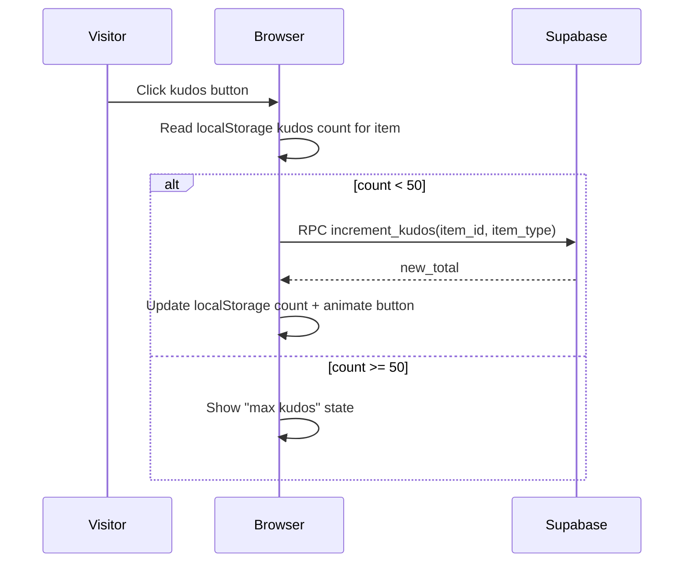

# Design Document: sandy.photography

## Overview

sandy.photography is a personal photography portfolio and blog built with React. It replaces an existing Astro-based site and is designed around two primary inspirations: glass.photo (masonry photo grid, native aspect ratios, crisp quality) and Medium (clean reading experience, in-browser rich-text editor). The site is admin-only authenticated — visitors browse freely, while Sandy (the admin) manages all content through in-browser interfaces without touching code.

The site lives at the custom domain `sandy.photography`, which Sandy already owns.

### Core Design Principles

- **Photography-first**: Images are served at native aspect ratios, full quality, via a global CDN
- **Apple-inspired aesthetics**: Neutral palette, generous whitespace, Radix UI primitives, Framer Motion transitions
- **Zero-deploy content management**: All content (photos, posts, projects, series) is managed in-browser
- **Visitor simplicity**: No accounts, no sign-up — kudos and browsing are fully anonymous
- **Performance**: Lighthouse 90+ on mobile, lazy loading, blur-up placeholders, WebP/AVIF delivery

---

## Architecture

### Tech Stack Decisions

| Layer | Choice | Rationale |
|---|---|---|
| Frontend | React + Vite | User preference; fast HMR, excellent ecosystem |
| Routing | React Router v7 | File-based or config-based routing, nested layouts |
| Styling | Tailwind CSS + Radix UI | Utility-first with accessible primitives; pairs well with Apple-inspired design |
| Animations | Framer Motion | Smooth page transitions, entrance animations, kudos micro-interactions |
| Rich Text Editor | Tiptap (ProseMirror-based) | Notion-like editing experience, extensible, headless — works with any styling |
| Backend / API | Supabase (PostgreSQL + Edge Functions) | Managed Postgres, real-time, Row Level Security for admin gating, generous free tier |
| Auth | Supabase Auth (Magic Link / OAuth) | No password storage; magic link email or GitHub OAuth for admin login |
| Image Storage & CDN | Cloudinary | Best-in-class image CDN: auto WebP/AVIF, responsive variants, EXIF extraction, global edge, original preservation |
| Hosting | Vercel | Custom domain support, edge network, zero-config React/Vite deploys, preview URLs |
| EXIF Extraction | `exifr` (client-side JS library) | Runs in-browser before upload; extracts full EXIF block without a server round-trip |

### Why Cloudinary over alternatives

- **Cloudflare Images**: No EXIF extraction API, limited transformation URL syntax
- **Imgix**: Excellent but requires S3 origin setup; more ops overhead
- **Cloudinary**: Native EXIF API, auto-format negotiation (`f_auto`), responsive width (`w_auto`), blur placeholder generation (`e_blur`), original file preservation, global CDN — all via URL parameters. Best fit for this use case.

### Why Supabase over alternatives

- **Firebase**: NoSQL — relational queries (photos by lens, series ordering) are awkward
- **PlanetScale / Neon**: Postgres-only, no built-in auth or storage
- **Supabase**: Postgres + Auth + Row Level Security + Edge Functions in one platform. RLS policies enforce admin-only writes at the database level, not just the API layer.

### Why Vercel over alternatives

- **Netlify**: Comparable, but Vercel has tighter Vite/React integration and better edge function DX
- **Cloudflare Pages**: Good, but Supabase Edge Functions already cover serverless needs
- **Vercel**: Custom domain with automatic TLS, preview deployments per branch, zero config

---

### System Architecture Diagram



### Request Flow: Photo Upload



### Request Flow: Kudos



---

## Components and Interfaces

### Page Routes

| Route | Component | Auth Required |
|---|---|---|
| `/` | `LandingPage` | No |
| `/photos` | `PhotosPage` | No |
| `/photos/[tag]` | `PhotosPage` (filtered) | No |
| `/photo/[id]` | `PhotoDetailPage` | No |
| `/series` | `AllSeriesPage` | No |
| `/series/[slug]` | `SeriesPage` | No |
| `/cameras/[make]/[model]` | `CameraBrowsePage` | No |
| `/lenses/[make]/[model]` | `LensBrowsePage` | No |
| `/blog` | `BlogListPage` | No |
| `/blog/[slug]` | `BlogPostPage` | No |
| `/projects` | `ProjectsPage` | No |
| `/about` | `AboutPage` | No |
| `/admin` | `AdminDashboard` | Yes |
| `/admin/upload` | `PhotoUploader` | Yes |
| `/admin/blog/new` | `BlogEditor` | Yes |
| `/admin/blog/[id]/edit` | `BlogEditor` | Yes |
| `/admin/series` | `SeriesManager` | Yes |
| `/admin/projects` | `ProjectsManager` | Yes |
| `/admin/about` | `AboutEditor` | Yes |
| `/login` | `LoginPage` | No |

### Key React Components

```
src/
  components/
    layout/
      Navigation.tsx          # Top nav with mobile collapse
      PageTransition.tsx      # Framer Motion wrapper
    photos/
      PhotoGrid.tsx           # Masonry grid
      PhotoCard.tsx           # Individual grid cell with blur-up
      PhotoViewer.tsx         # Full-screen lightbox modal
      KudosButton.tsx         # Clapping animation + count
      ShareButton.tsx         # Native share sheet / fallback
    blog/
      BlogList.tsx            # Post listing
      BlogPostLayout.tsx      # Medium-style reading layout
      ReadingProgress.tsx     # Top progress bar
      BlogEditor.tsx          # Tiptap wrapper
    series/
      SeriesCard.tsx          # Preview grid + metadata
      SeriesGrid.tsx          # All series listing
    projects/
      ProjectCard.tsx         # Title, description, tags, link
    admin/
      ProtectedRoute.tsx      # Auth guard wrapper
      UploadZone.tsx          # Drag-and-drop upload area
  hooks/
    useKudos.ts               # Kudos state + localStorage
    useShare.ts               # Web Share API with fallback
    usePhotoGrid.ts           # Masonry layout calculations
  lib/
    supabase.ts               # Supabase client
    cloudinary.ts             # URL builder helpers
    exif.ts                   # exifr wrapper + focal length calc
```

### Admin Route Protection

All `/admin/*` routes are wrapped in `ProtectedRoute`, which:
1. Checks Supabase Auth session on mount
2. Redirects to `/login` if no valid session
3. Supabase RLS policies independently enforce write restrictions at the DB level (defense in depth)

---

## Data Models

### `photos`

```sql
CREATE TABLE photos (
  id            UUID PRIMARY KEY DEFAULT gen_random_uuid(),
  cloudinary_id TEXT NOT NULL UNIQUE,        -- Cloudinary public_id
  secure_url    TEXT NOT NULL,               -- Cloudinary secure_url
  width         INTEGER NOT NULL,
  height        INTEGER NOT NULL,
  title         TEXT,
  description   TEXT,
  tags          TEXT[] DEFAULT '{}',
  capture_date  TIMESTAMPTZ,
  upload_date   TIMESTAMPTZ NOT NULL DEFAULT now(),
  updated_at    TIMESTAMPTZ,
  -- EXIF (auto-extracted, overridable)
  camera_make   TEXT,
  camera_model  TEXT,
  lens_make     TEXT,
  lens_model    TEXT,
  aperture      TEXT,                        -- e.g. "f/2.8"
  shutter_speed TEXT,                        -- e.g. "1/500"
  iso           INTEGER,
  focal_length_native   NUMERIC,             -- mm
  focal_length_equiv    NUMERIC,             -- 35mm equivalent, if crop sensor
  sensor_crop_factor    NUMERIC,             -- e.g. 1.5 for APS-C
  -- Manual override flags
  camera_overridden BOOLEAN DEFAULT FALSE,
  lens_overridden   BOOLEAN DEFAULT FALSE
);
```

### `series`

```sql
CREATE TABLE series (
  id          UUID PRIMARY KEY DEFAULT gen_random_uuid(),
  slug        TEXT NOT NULL UNIQUE,
  title       TEXT NOT NULL,
  description TEXT,
  created_at  TIMESTAMPTZ NOT NULL DEFAULT now(),
  updated_at  TIMESTAMPTZ
);
```

### `series_photos`

```sql
CREATE TABLE series_photos (
  series_id   UUID REFERENCES series(id) ON DELETE CASCADE,
  photo_id    UUID REFERENCES photos(id) ON DELETE CASCADE,
  position    INTEGER NOT NULL,             -- ordering within series
  PRIMARY KEY (series_id, photo_id)
);
```

### `blog_posts`

```sql
CREATE TABLE blog_posts (
  id            UUID PRIMARY KEY DEFAULT gen_random_uuid(),
  slug          TEXT NOT NULL UNIQUE,
  title         TEXT NOT NULL,
  content       JSONB NOT NULL,             -- Tiptap JSON document
  content_text  TEXT,                       -- plain text for word count / search
  status        TEXT NOT NULL DEFAULT 'draft' CHECK (status IN ('draft', 'published')),
  published_at  TIMESTAMPTZ,
  updated_at    TIMESTAMPTZ,
  created_at    TIMESTAMPTZ NOT NULL DEFAULT now()
);
```

### `projects`

```sql
CREATE TABLE projects (
  id          UUID PRIMARY KEY DEFAULT gen_random_uuid(),
  title       TEXT NOT NULL,
  description TEXT NOT NULL,
  tags        TEXT[] DEFAULT '{}',
  url         TEXT,
  position    INTEGER NOT NULL DEFAULT 0,   -- display order
  created_at  TIMESTAMPTZ NOT NULL DEFAULT now(),
  updated_at  TIMESTAMPTZ
);
```

### `kudos`

```sql
CREATE TABLE kudos (
  id        UUID PRIMARY KEY DEFAULT gen_random_uuid(),
  item_id   UUID NOT NULL,
  item_type TEXT NOT NULL CHECK (item_type IN ('photo', 'blog_post')),
  count     INTEGER NOT NULL DEFAULT 0,
  UNIQUE (item_id, item_type)
);
```

> Visitor-side clap tracking (max 50 per visitor per item) is stored in `localStorage` keyed by `kudos:{item_type}:{item_id}`. The DB stores only the aggregate count. No visitor PII is collected.

### `about`

```sql
CREATE TABLE about (
  id            UUID PRIMARY KEY DEFAULT gen_random_uuid(),
  bio           TEXT NOT NULL,
  profile_photo_url TEXT,
  links         JSONB DEFAULT '[]',         -- [{label, url}]
  updated_at    TIMESTAMPTZ
);
```

### Row Level Security Policies

```sql
-- Photos: anyone can read, only authenticated admin can write
ALTER TABLE photos ENABLE ROW LEVEL SECURITY;
CREATE POLICY "public read" ON photos FOR SELECT USING (true);
CREATE POLICY "admin write" ON photos FOR ALL USING (auth.role() = 'authenticated');

-- Same pattern applied to: series, series_photos, blog_posts (published only for public),
--   projects, about

-- Blog posts: visitors see only published posts
CREATE POLICY "public read published" ON blog_posts
  FOR SELECT USING (status = 'published');
CREATE POLICY "admin read all" ON blog_posts
  FOR SELECT USING (auth.role() = 'authenticated');
CREATE POLICY "admin write" ON blog_posts
  FOR ALL USING (auth.role() = 'authenticated');

-- Kudos: anyone can read and increment (via RPC), no direct insert/update from client
ALTER TABLE kudos ENABLE ROW LEVEL SECURITY;
CREATE POLICY "public read" ON kudos FOR SELECT USING (true);
-- Increment handled by a SECURITY DEFINER RPC function, not direct client writes
```

### Kudos RPC Function

```sql
CREATE OR REPLACE FUNCTION increment_kudos(p_item_id UUID, p_item_type TEXT)
RETURNS INTEGER
LANGUAGE plpgsql
SECURITY DEFINER
AS $$
DECLARE
  new_count INTEGER;
BEGIN
  INSERT INTO kudos (item_id, item_type, count)
  VALUES (p_item_id, p_item_type, 1)
  ON CONFLICT (item_id, item_type)
  DO UPDATE SET count = kudos.count + 1
  RETURNING count INTO new_count;
  RETURN new_count;
END;
$$;
```

---

## Image Upload and Delivery Pipeline

### Upload Flow

1. Admin selects files in `UploadZone`
2. Client validates: file type (JPEG, PNG, HEIC, WebP, RAW) and size (≤ 50 MB)
3. `exifr` extracts EXIF data client-side (aperture, shutter, ISO, focal length, camera, lens, capture date)
4. Focal length equivalent calculated: `equiv = native * crop_factor` (crop factor looked up from camera model table)
5. Browser requests a signed Cloudinary upload URL from a Supabase Edge Function
6. File uploaded directly from browser to Cloudinary (bypasses Vercel bandwidth limits)
7. Cloudinary returns `public_id`, `secure_url`, `width`, `height`
8. Browser inserts photo row into Supabase with all metadata
9. Photo_Grid updates via Supabase Realtime subscription (no reload)

### Cloudinary URL Construction

```
Base: https://res.cloudinary.com/{cloud_name}/image/upload/

Responsive delivery (Photo_Grid):
  /f_auto,q_auto,w_{viewport_width},dpr_{dpr}/{public_id}

Blur placeholder (blur-up):
  /f_auto,q_1,w_40,e_blur:1000/{public_id}

Full resolution (Photo_Viewer):
  /f_auto,q_auto/{public_id}

Original download:
  /fl_attachment/{public_id}
```

### Image Element Pattern

```tsx

```

Width and height attributes (or `aspect-ratio` CSS) prevent CLS per Requirement 8.5.

---

## Deployment and Custom Domain Setup

### Vercel Configuration

1. Connect GitHub repo to Vercel project
2. Build command: `vite build`
3. Output directory: `dist`
4. Environment variables: `VITE_SUPABASE_URL`, `VITE_SUPABASE_ANON_KEY`, `VITE_CLOUDINARY_CLOUD_NAME`

### Custom Domain

1. In Vercel project settings → Domains → Add `sandy.photography`
2. Vercel provides DNS records (A record + CNAME for `www`)
3. Update DNS at domain registrar to point to Vercel
4. Vercel auto-provisions TLS certificate via Let's Encrypt
5. `www.sandy.photography` → 301 redirect to `sandy.photography`

### Environment Variables

| Variable | Used By | Secret? |
|---|---|---|
| `VITE_SUPABASE_URL` | Client | No |
| `VITE_SUPABASE_ANON_KEY` | Client | No (anon key, RLS enforced) |
| `VITE_CLOUDINARY_CLOUD_NAME` | Client | No |
| `CLOUDINARY_API_SECRET` | Supabase Edge Function only | Yes |
| `SUPABASE_SERVICE_ROLE_KEY` | Supabase Edge Function only | Yes |

The Cloudinary API secret and Supabase service role key never reach the browser — they live only in Supabase Edge Function environment variables.

---

## Error Handling

### Upload Errors
- File type/size validation runs client-side before any network request; descriptive error shown per file
- Cloudinary upload failures surface a retry option per file; partial batch failures don't block successful uploads
- If Supabase INSERT fails after successful Cloudinary upload, the Edge Function logs the orphaned `public_id` for admin cleanup

### Blog Editor
- Tiptap content auto-saved to `localStorage` every 30 seconds and on blur
- On session expiry, content is preserved in `localStorage` and restored on next admin login (Requirement 4.7)
- Publish/save failures show an inline error with retry

### Kudos
- If Supabase RPC fails, the UI optimistically shows the incremented count and retries silently; on persistent failure it rolls back the displayed count
- localStorage cap enforcement is purely client-side; the DB has no per-visitor limit (aggregate only)

### Auth
- Expired sessions redirect to `/login` with `?redirect=` param so the admin returns to their original destination after re-auth
- Magic link expiry (15 min default) shown with a "resend link" option

### Image Loading
- Blur-up placeholder shown until full image loads (prevents layout shift)
- If Cloudinary URL fails, `` `onError` falls back to a neutral gray placeholder at the correct aspect ratio

---

## Testing Strategy

### Dual Testing Approach

Both unit tests and property-based tests are used. Unit tests cover specific examples, integration points, and edge cases. Property-based tests verify universal correctness across randomized inputs.

**Test stack:**
- Unit / integration: **Vitest** + **React Testing Library**
- Property-based: **fast-check** (TypeScript-native, works with Vitest)
- E2E (optional): **Playwright**

### Unit Test Focus Areas

- `exif.ts`: focal length equivalent calculation with known crop factors
- `cloudinary.ts`: URL builder output for specific transformation combinations
- `BlogEditor`: draft persistence to/from localStorage
- `ProtectedRoute`: redirect behavior for unauthenticated users
- `KudosButton`: localStorage cap enforcement at 50 claps
- `ReadingProgress`: word count → reading time calculation at 200 wpm
- `PhotoViewer`: keyboard navigation (Escape closes, arrow keys navigate)

### Property-Based Test Configuration

Each property test uses **fast-check** with a minimum of 100 runs (`numRuns: 100`).

Each test is tagged with a comment in this format:
```
// Feature: sandy-photography-website, Property {N}: {property_text}
```

Each correctness property is implemented by a single property-based test.

